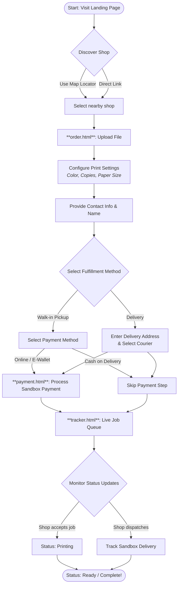
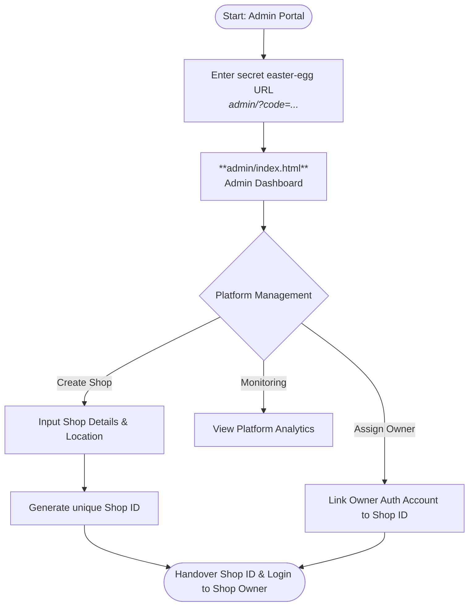

# 🖨️ PrintRUSH Lopez — User Flow Manual

This manual outlines the standard system routes and workflows for the three primary user roles: **Customers (Students)**, **Shop Owners**, and **Platform Admins**. 

---

## 👤 1. Customer (Student) Workflow
The customer flow is designed to be completely frictionless, requiring no account creation or app downloads.



---

## 🏪 2. Shop Owner Workflow
The shop owner manages the print queue using either the web portal or the native Windows Desktop Agent (which allows for silent printing and Bluetooth interception).


---

## 👑 3. Platform Admin Workflow
The Platform Admin is responsible for onboarding new shops, assigning owners, and managing the overall platform ecosystem.



---

## 💻 4. Desktop Agent Setup (For Shop Owners)
To unlock the full potential of your PrintRUSH shop (like silent printing and Bluetooth integration), you must install the Desktop Agent on your shop's primary Windows PC.

### Installation Steps:
1. **Prerequisites:** Ensure [Node.js](https://nodejs.org/) is installed on your PC.
2. **Download:** Open the `desktop-agent` folder in your terminal.
3. **Install Dependencies:** Run the command `npm install`
4. **Configuration:** Create a `.env` file inside the `desktop-agent` folder and add your shop details:
   ```env
   SUPABASE_URL=https://iovsadqmwnjssrcxvagu.supabase.co
   SUPABASE_ANON_KEY=your-anon-key-here
   SHOP_ID=your-shop-uuid-here
   APP_URL=https://print-rush-lopez.vercel.app
   BLUETOOTH_FOLDER=C:\Users\Public\Downloads
   ```
5. **Launch:** Run `npm start`.

### How to use it:
- **Bluetooth Walk-ins:** Once running, any file sent to your PC via Bluetooth will instantly pop up as a notification inside your Kanban board. Click "Create Job" to immediately add the walk-in to your queue.
- **Silent Printing:** Instead of manually opening files, just click **Print** on any PDF job card in your portal to send it directly to your default Windows printer.
- **Important:** These superpowers only work when viewing your shop portal *inside* the Desktop Agent window. If you open it in Google Chrome, it will run as a standard website.
