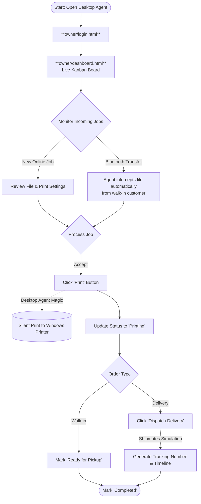

# 🖨️ PrintRUSH Lopez — User Flow Manual

This manual outlines the standard system routes and workflows for the three primary user roles: **Customers (Students)**, **Shop Owners**, and **Platform Admins**. 

---

## 👤 1. Customer (Student) Workflow
The customer flow is designed to be completely frictionless, requiring no account creation or app downloads.

---

## 🏪 2. Shop Owner Workflow
The shop owner manages the print queue using either the web portal or the native Windows Desktop Agent (which allows for silent printing and Bluetooth interception).

---

## 👑 3. Platform Admin Workflow
The Platform Admin is responsible for onboarding new shops, assigning owners, and managing the overall platform ecosystem.

---

## 💻 4. Desktop Agent Setup (For Shop Owners)
The PrintRUSH Desktop Agent is a **Windows application** that gives your shop superpowers — silent printing and automatic Bluetooth file detection. Setup takes less than 5 minutes and requires zero technical knowledge.

### What happens after your shop is confirmed:
1. You will receive an **email** from PrintRUSH with a download link and your unique **Shop ID** and **Key**.
2. Click the download link in the email to get the **PrintRUSH Agent Installer** (`.exe` file).
3. Double-click the installer → Click **Next → Next → Finish** (like any Windows program).
4. The app opens automatically and shows you a simple screen: **paste your Shop ID and Key** from the email.
5. Click **Connect My Shop** → Done! The portal loads and your shop is live. ✅

### The app runs silently in your system tray:
- Look for the PrintRUSH icon in your Windows taskbar tray (bottom-right corner).
- **Right-click** the icon to open your queue, check for updates, or quit.
- The app **auto-updates silently** — you will always have the latest version without doing anything.

### How to use the features:
- **Silent Printing:** Click the **Print** button on any job card in your portal to send it directly to your Windows printer. No opening files manually.
- **Bluetooth Walk-ins:** When a customer sends a file to your PC via Bluetooth, a notification pops up automatically inside your portal. Click **Create Job** to add them to the queue instantly.

> **Important:** The Print button and Bluetooth features only work when viewing your portal *inside the Desktop Agent*. Opening it in Google Chrome will run it as a standard website without these extras.

